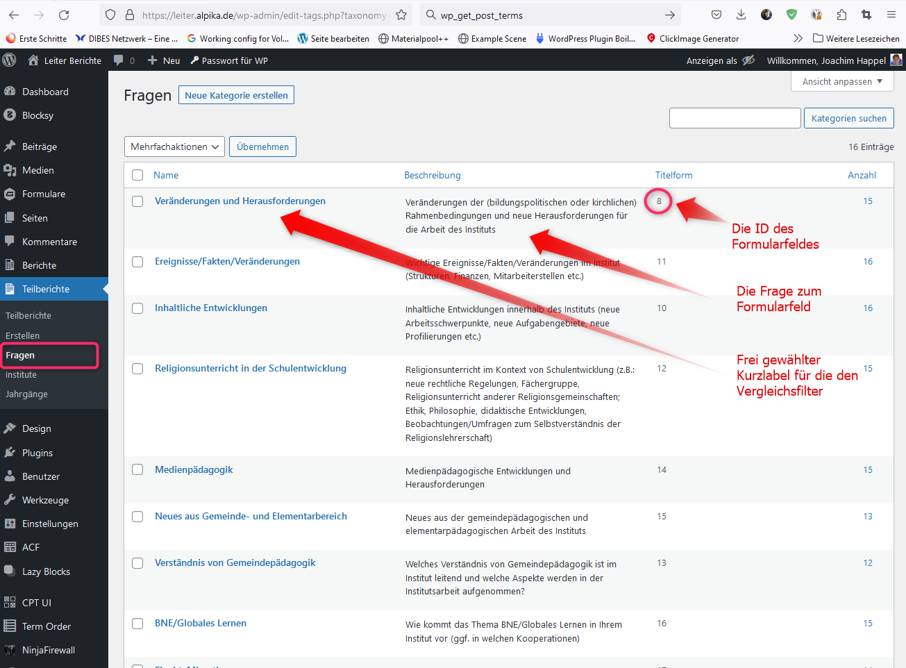

# ALPIKA Leiter Berichte

Berichte aus den Instituten werden mit Hilfe eines Gravity Formulars eingegeben. Bei Speichern der Eingabe wird das Ergebnis 
als Beitrog unter dem post_type "rpi_report" gespeichert Zusätzlich werden die einzelnen Antworten separat in weiteren
Beiträgen des Post Types Teilberichte ("rpi_report_section") gespeichert. 
Die dazugehörige Taxonomie Fragen ("question") ermöglicht die Zuordnung von Fragen zu Teilberichten.
Damit die Daten konsistent belieben ist folgendes zu beachten:

## Relation Formular zur Teilberichte Taxonomie "Fragen"
Die ID des Frage im Formular muss der der Titelform des entsprechenden Terms in Fragen entsprechen.
Wenn nachträglich die Frage im Formular angepasst wird, muss dies auch im Beschreibungsfeld der Taxonomie Fragen  gemacht werden.
Der Name des Einzelnen Terms kann hingegen beliebig geändert werden.

